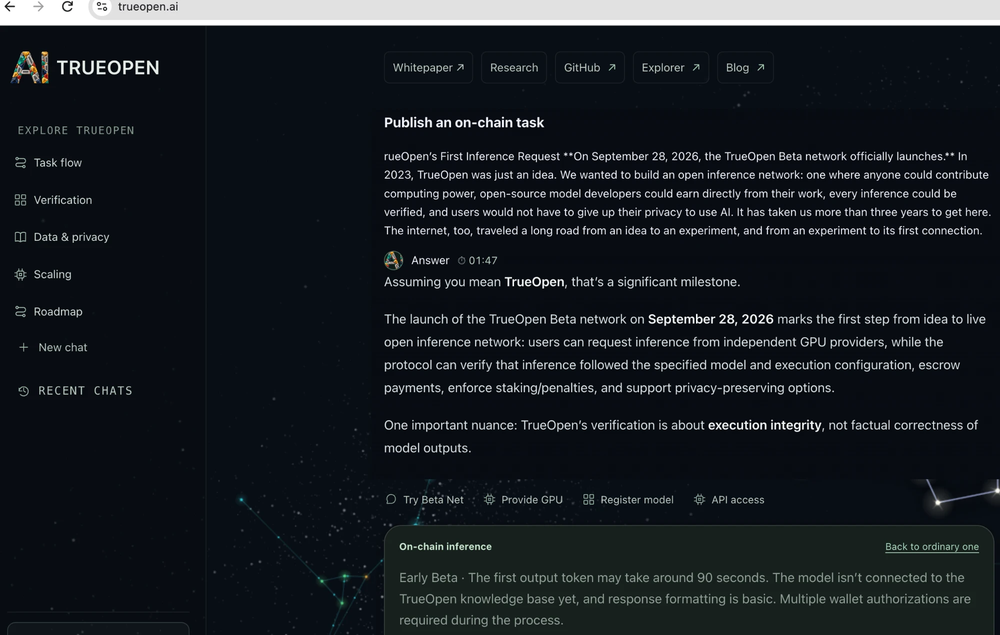

# TrueOpen’s First Inference Request

**On September 28, 2026, the TrueOpen Beta network officially launches.**

In 2023, TrueOpen was just an idea.

We wanted to build an open inference network: one where anyone could contribute computing power, open-source model developers could earn directly from their work, every inference could be verified, and users would not have to give up their privacy to use AI.

It has taken us more than three years to get here.

The internet, too, traveled a long road from an idea to an experiment, and from an experiment to its first connection. On October 29, 1969, researchers attempted to send a message over ARPANET from UCLA in Los Angeles to the Stanford Research Institute in Menlo Park, in the San Francisco Bay Area. The connection ran at 50 kbps—modest by today’s standards. They intended to send “LOGIN,” but only the first two letters, “LO,” arrived before the system crashed. About an hour later, they completed the login.

The internet that connects the world today once consisted of an imperfect exchange between two locations. What mattered was not its speed or scale, but that a connection once imagined had finally become real.

A beginning can be small without making the ambition behind it any smaller.

TrueOpen’s first inference request also came with a wait. The current Beta’s response speed and output experience do not yet meet the standards we have set for the production network. We have identified the main bottlenecks and how to address them: shortening Worker selection, increasing task concurrency, and improving how results are delivered and displayed.

The engineering work ahead of TrueOpen remains immense. Over the past three years, there were countless moments when we considered giving up. Our commitment to this mission kept bringing us back—to solve the next problem, build the next part of the system, and bring the idea a little closer to reality.

**On September 28, 2026, we submitted the first inference request through trueopen.ai.**

The model was **Qwen3.8-27B-FP8**. That first task has a public record:

**Task ID**

```text
bcf1582208d089272a8f6b4dbd7b65bdc31b17a02c6e7dd8361ff3b0851f9866
```

[View the first inference task on the TrueOpen Explorer ↗](https://explorer-testnet.trueopen.ai/en/task/bcf1582208d089272a8f6b4dbd7b65bdc31b17a02c6e7dd8361ff3b0851f9866)



*An on-chain inference task submitted and answered on trueopen.ai.*

**Today, September 28, 2026, the TrueOpen Beta network officially launches.**

At launch, the network is supported by four GPUs, four Validators, and three Builders.

As we begin, we also want to make our position clear:

**TrueOpen is a nonprofit organization building blockchain infrastructure for the public good. We do not raise funds through initial coin offerings. All code is developed openly, and all financial inflows and outflows are publicly recorded on-chain.**

We do not seek profit for the organization, but we want participants to earn income. Providing computing power and developing and maintaining open-source models should create direct opportunities to earn. The network’s protocol fees fund support for Builders, Validators, and other necessary expenses, sustaining its operation and continued development.

For us, blockchain provides a foundation on which collaboration, verification, and the movement of funds can be publicly inspected. We want to build a public network that more people can contribute to, maintain, and benefit from together.

Our next steps are to help more people discover and use TrueOpen, make the system faster and more reliable, strengthen privacy protections, and progressively improve its verification methods, including ZK technologies. As a nonprofit working for the public good, we need more developers, compute providers, and users to join us. We also need the network to be tested through real use and improved through open collaboration.

Openness, verifiability, and privacy are commitments that guide our ongoing work—not promises we can declare fully fulfilled with a Beta release.

But today, we have taken the first step.

Laozi wrote:

> “The Dao gives birth to One. One gives birth to Two. Two gives birth to Three. Three gives birth to all things.”

We hope TrueOpen can become a “One” that serves the common good. It does not have to be powerful from the start, but it should offer a beginning worth believing in and contributing to—a place where people who share this hope can find one another, bringing together goodwill, knowledge, and action. The network’s future will be shaped not by us alone, but by everyone who joins.

A great wind begins with the faintest stirring; a journey of a thousand miles begins with a single step. TrueOpen may be small today, but we aspire to the openness of the ocean, with room for contributions from every direction. We invite model developers, compute providers, and users to join us in building this shared network of cooperation.
