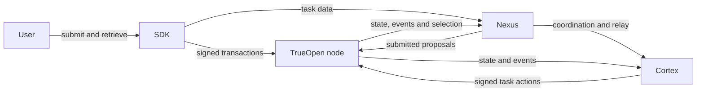

# Architecture

TrueOpen V1 consists of one on-chain state machine and three off-chain service layers.

| Component | Responsibility |
|---|---|
| **node** | Runs consensus and the keeper state machine. It owns task lifecycle state, selection results, deadlines, funds, settlement, and protocol accountability. |
| **nexus** | Runs with a Builder. It coordinates task proposals, transports control messages, stores task data, relays outputs, and submits transactions. |
| **cortex** | Runs with a Cortex Node. It executes inference or independently verifies another node's result for a specific task. |
| **SDK** | Gives users the interfaces for signing orders, submitting tasks, retrieving results, querying chain state, and opening challenges. |

## Trust boundary

Task inputs, outputs, and evidence are transferred off-chain over authenticated connections. They are not placed directly on-chain. The chain instead records the state transitions, commitments, deadlines, and accepted actions required to coordinate and settle the task.

An off-chain observation cannot directly move funds or assign protocol responsibility. It must be represented by a valid protocol action that the on-chain state machine can evaluate consistently.
