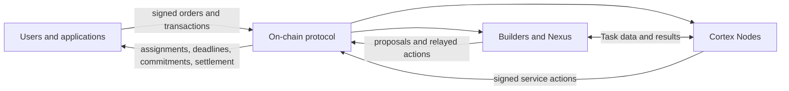

# Protocol

The TrueOpen protocol coordinates accountable AI inference without placing model execution or bulk Task data on-chain. The chain owns the identities, assignments, deadlines, commitments, economic state, settlement, and finality required for independent participants to reach the same result.

This section explains the design principles, trust assumptions, mechanisms, and algorithms behind TrueOpen, alongside the versioned rules implementations must follow. Design explanations and stage walkthroughs provide context; versioned rules define protocol requirements.

Start with [Design principles](design-principles.md) and the [Trust model](trust-model.md), then explore the [V1 protocol](v1/README.md).

## Current version

| Version | Status | Scope |
|---|---|---|
| [V1](v1/README.md) | Current documentation track | Phase 0 chain, service participation, Task execution, verification, economics, governance, and canonical asset route |

A network release identifies the exact protocol and software versions it supports. Implementations must not infer compatibility from a page title or silently substitute rules from another version.

## Protocol boundary

The protocol governs accepted actions and state transitions. Task inputs, model execution, outputs, and most evidence move through authenticated off-chain services, but off-chain arrival or acknowledgement cannot independently assign responsibility or move funds.

## How to read this documentation

- Start with the [V1 overview](v1/README.md) for domain relationships and system-wide invariants.
- Read [protocol conventions](v1/foundations/conventions.md), [accounts and signatures](v1/foundations/accounts-and-signatures.md), [Models and Profiles](v1/foundations/models-and-profiles.md), and [randomness](v1/foundations/randomness.md) for foundational rules.
- Use [service participation](v1/service-participation/README.md) for provider responsibility and bonds.
- Use the [Task protocol](v1/tasks/README.md) for admission through finality.
- Read economics, governance, and cross-chain pages for their respective state domains.
- Follow the stage walkthroughs within [Task lifecycle](v1/tasks/README.md) for participant-by-participant interactions and their governing rules.

## Documentation policy

Protocol pages are maintained and reviewed in this repository. Draft proposals, open questions, implementation blockers, and future-roadmap material are not protocol documentation.
