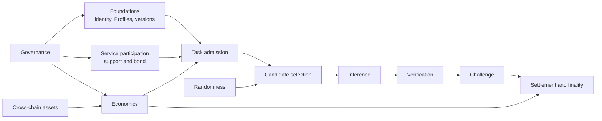

# V1 protocol

TrueOpen V1 defines a single Cosmos SDK application chain for coordinating and settling AI inference tasks. Computation and task data remain off-chain, while the chain owns identity, selection, deadlines, commitments, accountability, funds, settlement, and finality.

## Scope

V1 specifies:

- Account identities, authorization, signatures, and key separation
- Registered Models and immutable Profile versions
- Cortex Node admission, support, ServiceBond liability, penalties, and exit
- Task orders, candidate selection, inference receipts, data commitments, verification, challenges, settlement, and finality
- Business-asset accounting, claims, treasury boundaries, and transaction-fee treatment
- Consensus randomness used for participant selection
- Governed parameter, membership, emergency, and software-upgrade actions
- The canonical Phase 0 cross-chain asset route and its safety controls

V1 does not make an off-chain service a final protocol judge, place bulk Task data on-chain, guarantee origin-chain bridge delivery after a local withdrawal burn, or define unreleased client and operator interfaces.

## Domain relationships

## Protocol map

| Domain | Purpose |
|---|---|
| [Protocol conventions](foundations/conventions.md) | Defines normative language, authority, deterministic interpretation, and versioning. |
| [Accounts and signatures](foundations/accounts-and-signatures.md) | Defines identity and authorization. |
| [Models and Profiles](foundations/models-and-profiles.md) | Defines immutable execution and verification configurations. |
| [Selection and randomness](foundations/randomness.md) | Defines beacon-based assignment and its connection to candidate selection. |
| [Service participation](service-participation/README.md) | Separates consensus stake from service responsibility and defines the Cortex Node bond lifecycle. |
| [Task protocol](tasks/README.md) | Defines orders, assignment, inference, verification, challenges, settlement, and finality. |
| [Economics](economics.md) | Defines the Phase 0 asset, task budgets, fees, refunds, claims, and treasury boundaries. |
| [Governance](governance.md) | Defines parameter changes, emergency actions, set replacement, treasury spending, and upgrades. |
| [Cross-chain assets](cross-chain-assets.md) | Defines the canonical USDC route, bridge security, supply conservation, and freeze controls. |

## State authority

| State or material | Protocol authority |
|---|---|
| Accounts, Profiles, support, assignments, deadlines, balances, and finality | Accepted on-chain state |
| Candidate and parameter inputs for an accepted Task | Immutable on-chain snapshots |
| Input, output, and evidence bodies | Off-chain objects checked against committed digests |
| Builder or Nexus acknowledgement | Transport observation only |
| Cortex or model-runtime status | Local observation only |

See [Protocol conventions](foundations/conventions.md) for normative language, deterministic interpretation, versioning, and fail-closed behavior.

## System-wide invariants

All V1 domains must preserve these properties:

- Only accepted on-chain actions, consensus deadlines, and deterministic protocol runners create protocol facts.
- Off-chain arrival order, private scoring, local clocks, and service observations cannot directly assign responsibility or move funds.
- Every Task is bound to one model profile, one order version, one candidate snapshot, and one Task Builder group for its lifetime.
- Historical Tasks use the rules and parameter snapshots fixed when they were accepted. Later governance changes do not reinterpret them.
- Funds are isolated by purpose. Task escrow, service bonds, challenge bonds, claimable earnings, the treasury, and consensus stake cannot silently cover one another.
- Settlement and finality occur together after all permitted verification rounds close.
- Unknown versions, missing required randomness, inconsistent commitments, and failed invariants fail closed.

For a staged explanation, follow the walkthroughs in [Task lifecycle](tasks/README.md).
