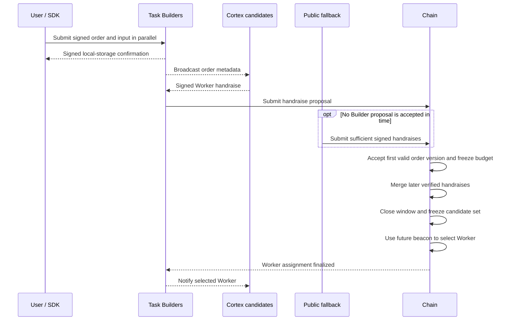

# 01 — Open Task

Open Task begins when a User submits a signed order and its input. It ends only when the chain finalizes one selected Worker.

## User submission

The SDK determines the Task Builders from the signed order context and submits the order and input to them as one logical operation. Each Builder authenticates the User, verifies the input commitment, stores its own copy, and returns a signed local confirmation.

A Builder confirmation means only that this Builder stored the input. It does not mean the Task is on-chain, the User's sequence was consumed, funds were frozen, or a Worker was selected.

The SDK may collect confirmations for redundancy and later audit. Cross-Builder reconciliation is useful but is not a prerequisite for broadcasting metadata or collecting handraises.

## Candidate broadcast and handraise

Builders broadcast order metadata, not the full input, to eligible Cortex Node candidates. A candidate decides locally whether it can perform the Task and returns a signed Worker handraise.

Builders aggregate valid handraises and submit proposals to the chain. The first accepted proposal atomically:

- Verifies the User's order signature and Session sequence
- Locks one authoritative order hash
- Freezes the User's maximum fee in Task escrow
- Locks the chain anchor, Builder set, Task Builders, Profile, and candidate snapshot
- Initializes the authoritative union of Worker handraises

Later proposals for the same Task may add newly verified handraises. They cannot remove candidates, switch the order version, replace the snapshot, or change the Task Builders.

## Public fallback

If no Builder proposal is accepted before the Builder window closes, any account may submit enough valid signed handraises before the order expires. The fallback submitter does not become a Builder and gains no control over the order. The same admission checks and immutable Task facts apply.

## Assignment

At the cutoff, the chain materializes the frozen candidate set and waits for the predetermined future randomness height. The weighted draw chooses exactly one Worker from that set.

The assignment-finalized event, not a handraise-accepted event, creates Worker responsibility. Only then may the selected Worker retrieve the full input.

## Failure and retry boundaries

- Failure to store input at one Builder affects that copy; the SDK may retry another assigned Builder.
- No valid candidate produces a deterministic admission or assignment failure and refund path.
- A late change to stake or support cannot insert another candidate into the frozen set.
- If the selected Worker becomes terminally ineligible before responsibility begins, the Task follows the defined failure path rather than selecting an outside node.

See [Orders and task identity](orders-and-identity.md) and [Candidate selection](candidate-selection.md).
