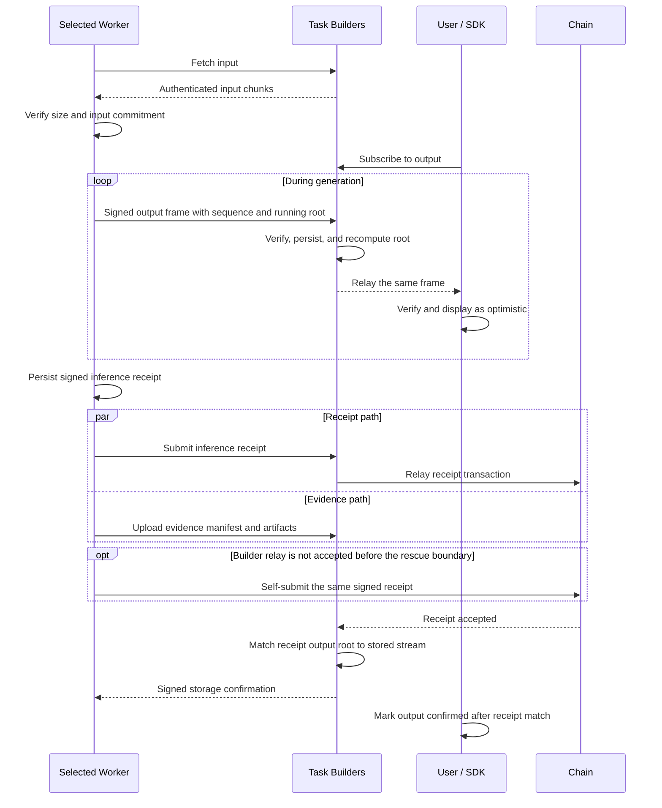

# 02 — Inference

Inference begins after Worker assignment. The Worker retrieves the input, executes the bound Profile, streams output, commits to its result, and makes the required evidence available.

## Retrieve and verify input

The selected Worker authenticates to any available Task Builder and downloads the input. Before execution it verifies the size and input commitment fixed by the accepted order.

Retries across Task Builders do not pause the inference deadline. A candidate that was not selected cannot use its earlier handraise to retrieve the input.

## Stream output

As generation progresses, the Worker sends ordered frames. Each frame binds its sequence, text bytes, cumulative output commitment, and Worker signature.

A Builder checks the Worker identity, sequence continuity, signature, and cumulative commitment before persisting and relaying the frame. The User performs the same checks and may show the output as optimistic while generation continues.

If the User disconnects, it can resume from its last verified sequence using another Task Builder or retrieve the completed output later. A User delivery acknowledgement is a local progress signal, not a protocol receipt and not a settlement condition.

## Receipt and evidence proceed in parallel

The Worker persists its signed inference receipt before sending it. The receipt binds the Task, Profile execution context, output root, generated work count, and required evidence commitments.

The receipt is small and can be relayed on-chain while larger evidence artifacts continue uploading. Submitting the receipt does not release the Worker from its data-availability responsibility.

The normal path uses a Builder to submit the receipt. If it is not accepted before the rescue boundary, the Worker may submit the same signed material directly.

## Data-ready transition

After receipt acceptance, each Builder compares the receipt's output commitment with the stream it independently reconstructed. A match plus complete required evidence allows that Builder to issue a storage confirmation and become locally data-ready.

One fully data-ready Task Builder can start its Open Verify coordination. Redundant Builder confirmations are the normal availability target, but waiting for a cross-Builder quorum is not the Open Verify gate.

If a Builder sees inconsistent signed stream commitments or a receipt that does not match the stored stream, it preserves the material for objective fault handling rather than rewriting one value to match the other.

See [Data and evidence](data-and-evidence.md) and [Verification](verification.md).
