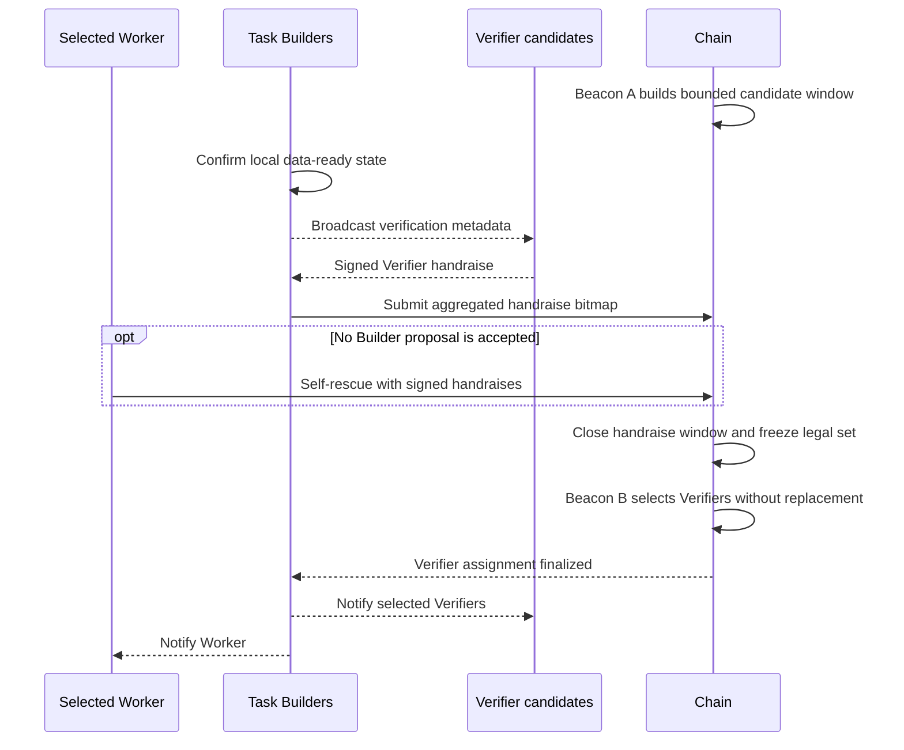

# 03 — Open Verify

Open Verify starts only when the inference receipt is accepted and at least one Task Builder has a complete, verified local copy of the input, output, and required evidence.

## Why data-ready matters

Receipt acceptance proves that the Worker made an on-chain commitment. It does not prove that a Verifier can retrieve the committed data.

A Task Builder begins Open Verify only after it has locally verified all required material. When the chain accepts that Builder's Verifier-handraise proposal, the proposal also creates the Builder's formal data-ready declaration for round 1.

A Worker self-rescue proposal can preserve Task liveness but does not create a data-ready declaration on behalf of a Builder.

## Beacon A: bound the population

The first future beacon ranks the previously frozen eligible population and creates a bounded Verifier candidate window. Only those candidates receive the opportunity to handraise for this Task.

This boundary must exist before the final selection. If every eligible node could observe the process and handraise without a bounded window, an operator controlling many nodes could flood the legal set and dilute independent candidates.

## Handraise aggregation

Candidates see Task and Profile metadata, not full input or output data. A candidate signs a Task-specific Verifier handraise and sends it to a Task Builder.

Handraises do not each require a transaction. Builders verify and aggregate them into the stage bitmap, then submit proposals. Accepted proposals may only add valid bits to the same Task-local union.

If all Builder proposals fail to reach the chain, the selected Worker may submit equivalent signed handraise material during the fixed rescue interval. The rescue does not extend the cutoff.

## Beacon B: select the Verifiers

The legal set freezes at the predetermined handraise close height. A strictly later beacon selects the required Verifiers using the frozen weights and liability checks.

Runner backlog may delay when the transition is materialized, but it cannot change the cutoff, include late handraises, or choose a newer randomness height.

Only after assignment may the selected Verifiers download the actual Task data. Their verification deadline continues while they retry the fixed Task Builders.

## Failure boundary

If too few legal candidates exist, the Task enters the verification-unavailable and refund path. The Worker is not penalized merely because the network could not form a Verifier set.

See [Candidate selection](candidate-selection.md), [Randomness](../foundations/randomness.md), and [Data and evidence](data-and-evidence.md).
