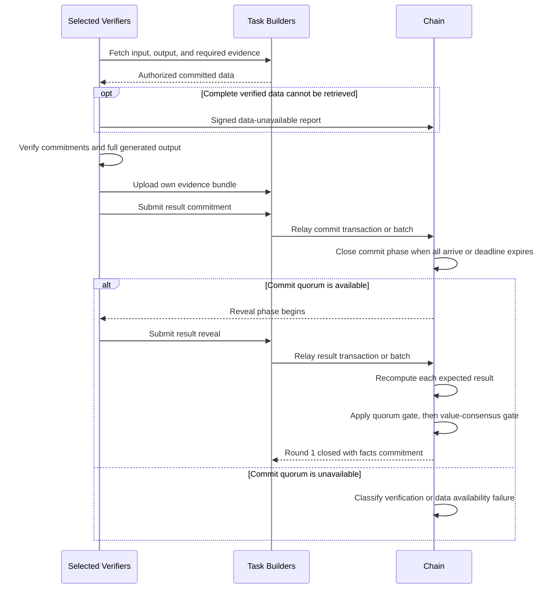

# 04 — Verification

Verification begins when the round-1 Verifier set is finalized. Each selected Verifier independently downloads the same committed Task data and evaluates the full output.

## Retrieve and validate

Each selected Verifier authenticates with the fixed Task Builders and retrieves the input, output, Worker evidence, and Profile material required by the Task's evidence schema.

Before model computation, it checks hashes, sizes, receipt commitments, Profile version, tokenizer, generation parameters, and evidence types. Material for another Task, Profile version, or round is invalid even if it is otherwise well formed.

If no Builder can provide a complete valid set, a selected Verifier may directly submit a signed unavailability report before the commit deadline. One report or a service log is not enough to assign responsibility; the chain applies the defined threshold and Builder coverage rules.

## Compute the result

For text-generation verification, the Verifier evaluates every committed generated token position using the frozen prefill or teacher-forcing procedure. It does not sample random positions or rerun unconstrained autoregressive generation.

The Verifier produces a result value, metric summary, metric commitment, and evidence-bundle commitment. It stores its own signed material before relay and uploads its evidence bundle to the Task Builders.

## Commit phase

The Verifier first submits a commitment to its complete result payload and private salt. This hides the decision while other selected Verifiers are still computing.

The reveal phase may begin early only when every selected Verifier has committed. A threshold-sized subset is not enough for the fast path because an uncommitted Verifier could otherwise observe revealed answers and copy them. If not all commits arrive, the protocol waits until the commit deadline and proceeds only if the required quorum exists.

## Reveal and two gates

After reveal begins, each Verifier submits the result payload and salt. The chain rejects a reveal that does not match the commitment or whose metrics do not deterministically produce the submitted result.

Closing the round uses two gates:

1. **Quorum gate:** enough valid selected Verifier results must exist.
2. **Value-consensus gate:** a sufficiently large cluster must agree on the same verdict and work-unit count.

A bare `PASS` or `REJECT` is insufficient. It must be supported by a valid committed result and its required metric and evidence commitments.

## Close round 1

Round 1 closes when all valid reveals arrive or the reveal deadline expires. The chain records the outcome, verdict, participant facts, and immutable round-facts commitment.

Closing round 1 moves no funds. The verdict remains challengeable until the challenge window closes, and no service earnings become claimable.

See [Verification](verification.md) and [Challenges and settlement](challenges-and-settlement.md).
