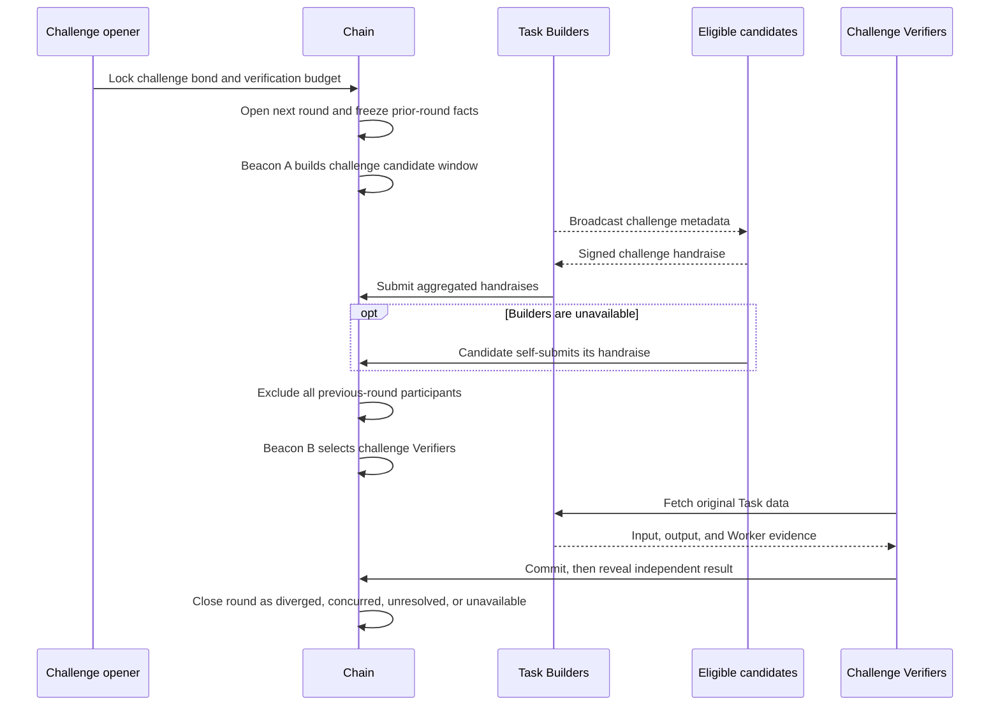

# 05 — Challenge round

The challenge window begins when round 1 closes. A challenge does not reverse a completed payment: no settlement has occurred yet.

## Open the round

Any address may open a challenge during the window. The opener locks both the required bond and the maximum budget for the challenge Verifiers. Identity or possession of evidence is not an eligibility requirement.

The chain chooses the next round number and freezes:

- The authoritative Task and previous round-facts commitment
- The input, output, receipt, Profile, and generation-parameter commitments
- Every prior-round participant to exclude
- The candidate, selection, commit, reveal, and close boundaries

The opener cannot submit a verdict, choose the Verifiers, or modify the Task data.

## Select an independent committee

Challenge selection has its own candidate window and future randomness. It excludes the Worker and all Verifiers who participated in previous rounds.

Builders normally aggregate signed handraises. If they are unavailable, an eligible candidate can submit its own signed handraise directly. The disputed Worker does not control the challenge rescue path.

If too few independent candidates exist, the round closes as unavailable. The previous verdict remains effective; the protocol does not silently reuse earlier Verifiers or pick an outside node.

## Re-evaluate the original Task

Challenge Verifiers receive the original input, output, Worker evidence, Profile, and generation context. They do not rerun Worker inference and do not use the previous Verifiers' private evidence as their computation input.

The round has its own commit-reveal context. Including the round number in the commitments prevents material from round 1 from being replayed into round 2.

## Round outcomes

| Outcome | Meaning | Effect |
|---|---|---|
| `DIVERGED` | A valid challenge consensus contradicts the prior verdict | New verdict becomes effective; opener bond returns; disproved parties lose payment eligibility and may be penalized |
| `CONCURRED` | A valid challenge consensus matches the prior verdict | Prior verdict remains effective; opener pays verification cost and forfeits the configured bond amount |
| `UNRESOLVED` | The round lacks quorum or value consensus | Prior verdict remains effective; independent missing-duty rules apply |
| `UNAVAILABLE` | A challenge committee or required data cannot be formed under the rules | Prior verdict remains effective; bounded incurred costs are charged |

Not disproving the earlier verdict is not the same as proving it correct. The round records exactly which outcome occurred.

## What does not require a challenge

A challenge exists for semantic disagreement that requires independent model re-execution. The following use their direct protocol paths instead:

- Invalid material detectable when submitted is rejected immediately.
- Missing duties visible at a deadline are processed by the deadline runner.
- Contradictory signatures use the objective equivocation path.
- Data retrieval failure uses threshold availability reporting.

These faults do not require an opener bond and do not create a new verification round.

See [Challenges and settlement](challenges-and-settlement.md) and [Economics](../economics.md).
