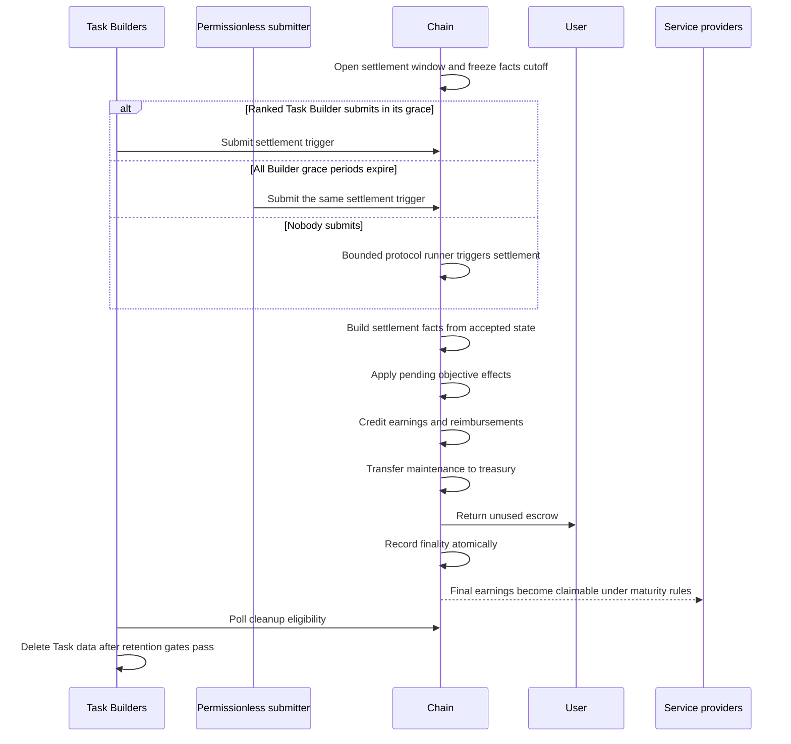

# 06 — Settlement and finality

Settlement begins only when no verification round is open and the challenge window cannot admit another round. The effective verdict is the verdict of the latest applicable closed round.

## Trigger paths

Task Builders receive ranked opportunities to submit the settlement trigger. Only one valid submission is required; the Builders do not co-sign the final accounting plan.

After all Builder grace periods expire, the selected Worker, a Verifier, or any maintenance submitter may trigger the same transition. The submitter pays transaction fees but cannot change the verdict, recipients, amounts, or facts cutoff.

If nobody submits, a bounded protocol runner invokes the same settlement builder. Submission backlog may change the execution height, but not the frozen facts used for accounting.

## Build from accepted state

The chain derives the plan from immutable Task, round, receipt, result, gas-reimbursement, and responsibility state. The caller does not supply a bill or alternative participant list.

Before paying, settlement applies any confirmed objective effects whose protocol boundary is finality. It then:

- Pays an eligible Worker only under the effective successful verdict
- Pays eligible round-1 Verifier slots that were not later disproved
- Pays recorded eligible Task transaction-fee reimbursement
- Sends maintenance deductions to the treasury
- Returns all remaining Task escrow to the User

Challenge Verifiers were funded from the separate challenge budget and are not paid again from the User's Task escrow.

## Atomic finality

All balance transfers, earnings credits, refunds, fault effects, settlement facts, and the Task finality height are committed in one transaction. Any failed invariant rolls back the entire transition.

There is no “settled but still challengeable” state and no need to reverse an earlier payment. Participants disproved by a challenge are simply excluded from the only settlement plan ever applied.

The round-1 verdict can be queried before settlement, but it is not an account balance or claimable entitlement.

## Claims

Settlement credits service earnings to the rewards ledger. The applicable maturity rule determines when an operator may withdraw them. A claim does not recalculate the Task; it withdraws an already finalized entitlement.

## Data cleanup

Finality does not necessarily authorize immediate deletion. Task Builders and Cortex Nodes retain input, output, and evidence until every configured retention and responsibility gate passes.

Cleanup polling verifies that:

- The Task is final
- No round or economic effect remains open
- Challenge and evidence-retention margins have ended
- Required audit commitments remain preserved

Only then may large Task data be deleted. Cleanup never erases the minimal facts needed to explain the final verdict and accounting plan.

See [Challenges and settlement](challenges-and-settlement.md), [Economics](../economics.md), and [Data and evidence](data-and-evidence.md).
