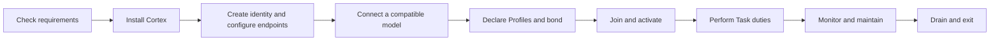

# Providers

Run a Cortex Node to provide inference and verification capacity. This guide covers connecting compatible model capacity, accepting accountable Task duties, and keeping the node healthy through operation and exit.

You do not need this guide if you only submit Tasks from an application. Start with [Use TrueOpen](../developers/README.md) instead. If you develop the adapter or model-serving integration used by an operator, use the [model integrator guide](model-integration/README.md).

## Is this role for you?

A compute provider is responsible for:

- Maintaining an operator identity, online service key, and ServiceBond
- Supplying hardware and a model runtime compatible with declared Profiles
- Keeping chain, Nexus, model, and evidence-storage connections healthy
- Deciding when to offer capacity and at what local price floor
- Completing Worker or Verifier duties before chain-height deadlines
- Retaining evidence through challenge and cleanup windows
- Monitoring, upgrading, recovering, draining, and exiting the node safely

Running a Cortex Node creates economic responsibility. A missed or invalid accepted duty may affect the provider's bond.

## Operator journey

## Start here

For a participation walkthrough, see [Model and node activation](model-and-node-activation.md) and [Node lifecycle](node-lifecycle.md). Adapter developers can use the dedicated [Model integration](model-integration/README.md) guide.

1. Review the [requirements](requirements.md) before acquiring hardware or depositing a bond.
2. Follow the [provider quickstart](quickstart.md) to understand the complete setup and activation sequence.
3. Configure [Profiles and capabilities](profiles-and-capabilities.md).
4. Learn when [Worker and Verifier duties](task-duties.md) become binding.
5. Prepare monitoring, backups, and restart procedures with [Operations and recovery](operations-and-recovery.md).
6. Review [Security and exit](security-and-exit.md) before putting funds or sensitive Task data at risk.


Release-specific commands, image names, ports, network IDs, minimum bond values, and hardware matrices will be added when public release artifacts are available. The sequence and safety requirements documented here still apply.

