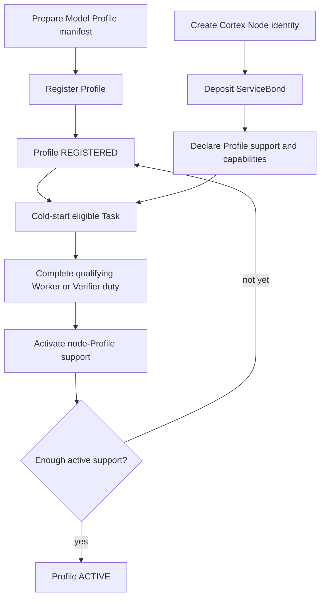

# Model and node activation

Model registration and Cortex Node activation are separate lifecycles. They meet when a real Task proves that a bonded node can serve a registered Profile.

## 1. Register the Profile

The registrant prepares a versioned Profile manifest that binds model artifacts, tokenizer, runtime requirements, Task schemas, verification rules, resource tier, minimum ServiceBond, and pricing boundaries.

Registration creates an immutable `model_id` and `profile_version` projection. The initial state is `REGISTERED`. Registration proves that the Profile definition is complete and addressable; it does not prove that enough Cortex Nodes can run it.

## 2. Bond the Cortex Node

The operator creates one Cortex Node identity, authorizes its current service key, and deposits a ServiceBond. Bonding creates the responsibility and penalty domain for AI service work. It does not automatically make the node eligible for every Profile.

## 3. Declare support

The node declares support separately for each Profile and for the capabilities it can provide:

- Inference capability allows it to volunteer for Worker duties.
- Verification capability allows it to volunteer for Verifier duties.

One node may support several Profiles. Each `(operator, model_id, profile_version)` support relationship has its own freshness and activation state. Activating one Profile does not activate another.

## 4. Complete support activation

A support declaration is a claim, not evidence of successful service. The protocol uses a qualifying real duty to activate the node-Profile relationship.

The activation evidence depends on the capability, but both Worker and Verifier activation update the same node-Profile support relationship. A node is counted at most once as an active supporter for that Profile even if it supports both duties.

Registered Profiles may use the defined cold-start eligibility path so the first real Tasks are possible before the active-support threshold has been reached.

## 5. Derive Profile activity

When the Profile has sufficient active and current support, the chain derives its `ACTIVE` state. Activity is therefore a property of the Profile's supported service capacity, not a manual marketing flag.

Both `REGISTERED` and `ACTIVE` Profiles may accept Tasks under the applicable admission rules. `ACTIVE` additionally indicates that the support conditions required by later eligibility policies have been met.

## Ongoing checks

Task admission and assignment check both sides:

- The Profile must allow new Tasks.
- The node must support that exact Profile version.
- The relevant capability must be enabled.
- Support freshness, bond, jail, tombstone, and exit state must permit the duty.

A node can load or unload other Profiles locally, but it cannot change the Profile already bound to an accepted Task.

See [Models and profiles](../protocol/v1/foundations/models-and-profiles.md), [Staking and penalties](../protocol/v1/service-participation/staking-and-penalties.md), and [Candidate selection](../protocol/v1/tasks/candidate-selection.md).
