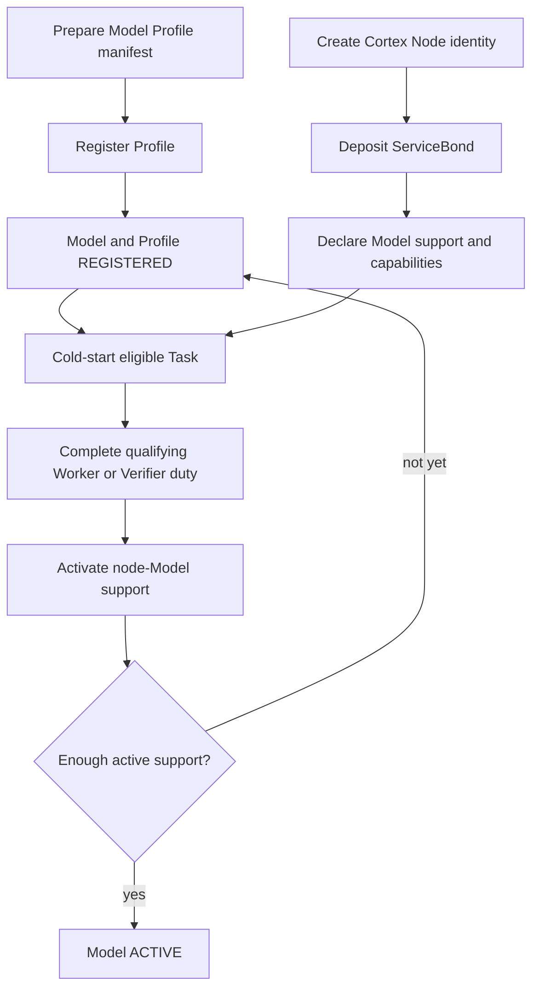

# Model and node activation

Model registration and Cortex Node activation are separate lifecycles. They meet when a real Task proves that a bonded node can serve a registered version of a Model.

```mermaid
flowchart TD
    A[Prepare Model Profile manifest] --> B[Register Profile]
    B --> C[Model and Profile REGISTERED]
    D[Create Cortex Node identity] --> E[Deposit ServiceBond]
    E --> F[Declare Model support and capabilities]
    C --> G[Cold-start eligible Task]
    F --> G
    G --> H[Complete qualifying Worker or Verifier duty]
    H --> I[Activate node-Model support]
    I --> J{Enough active support?}
    J -->|yes| K[Model ACTIVE]
    J -->|not yet| C
```

## 1. Register the Profile

The registrant prepares a versioned Profile manifest that binds model artifacts, tokenizer, runtime requirements, Task schemas, verification rules, resource tier, minimum ServiceBond, and pricing boundaries.

Registration creates an immutable `model_id` and a versioned Profile projection. The Model and new Profile start as `REGISTERED`. Registration proves that the Profile definition is complete and addressable; it does not prove that enough Cortex Nodes can run it.

## 2. Bond the Cortex Node

The operator creates one Cortex Node identity, authorizes its current service key, and deposits a ServiceBond. Bonding creates the responsibility and penalty domain for AI service work. It does not automatically make the node eligible for every Profile.

## 3. Declare support

The operator declares support for a Model and the capabilities it can provide:

- Inference capability allows it to volunteer for Worker duties.
- Verification capability allows it to volunteer for Verifier duties.

One operator may support several Models. Each `(operator_address, model_id)` support relationship has its own activation and freshness state. Registering another Profile version of the same Model does not require another support declaration. Local readiness and Task eligibility still depend on the exact Profile version.

## 4. Complete support activation

A support declaration is a claim, not evidence of successful service. The protocol uses a qualifying real duty under a registered Profile to activate the node-Model relationship.

The activation evidence depends on the duty, but both Worker and Verifier activation update the same node-Model support relationship. An operator is counted at most once as an active supporter for the Model, across duties and Profile versions.

Registered Models and Profiles may use the defined cold-start eligibility path so the first real Tasks are possible before the Model's active-support threshold has been reached.

## 5. Derive Model activity

When the Model has enough distinct active supporters and support stake, the chain derives its `ACTIVE` state. Activity is a property of Model-level service capacity, not a status assigned to individual Profile versions.

The Profile remains `REGISTERED` while it is available for new Tasks; it never becomes `ACTIVE`. A `REGISTERED` or `ACTIVE` Model can accept Tasks under the applicable admission rules when the selected Profile is `REGISTERED`. Model `ACTIVE` also gates the applicable maturity checks.

## Ongoing checks

Task admission and assignment check both sides:

- The Model and selected Profile must both allow new Tasks.
- The operator must have fresh support for the Model and local readiness for that Profile version.
- The relevant capability must be enabled.
- Support freshness, bond, jail, tombstone, and exit state must permit the duty.

A node can load or unload other Profiles locally, but it cannot change the Profile already bound to an accepted Task.

See [Models and profiles](../protocol/v1/foundations/models-and-profiles.md), [Staking and penalties](../protocol/v1/service-participation/staking-and-penalties.md), and [Candidate selection](../protocol/v1/tasks/candidate-selection.md).
