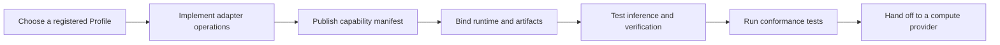

# Model integration

This guide is for developers who implement or maintain the adapter between Cortex and model compute. It is not an operator installation guide and does not cover bonding, earnings, or day-to-day node operation.

The integration boundary has three goals:

- Present stable health, capability, inference, and verification operations to Cortex
- Bind every result to the exact Task, Profile, duty, and runtime requested by Cortex
- Keep protocol signing and chain access outside the model runtime

## Integration path

Read [Cortex architecture](cortex-architecture.md) for the control plane and runtime trust boundaries.

Start with the [model adapter interface](adapter-interface.md), define the [Profile and capability manifest](profile-manifest.md), then run [conformance testing](conformance-testing.md). Operators consuming the integration should follow [Providers](../README.md).

## Responsibility boundary

The adapter produces raw result and evidence material. Cortex validates the bindings, constructs protocol material, persists responsibility state, and signs. The model runtime must not hold the provider's service key, submit chain transactions, or decide final settlement.
