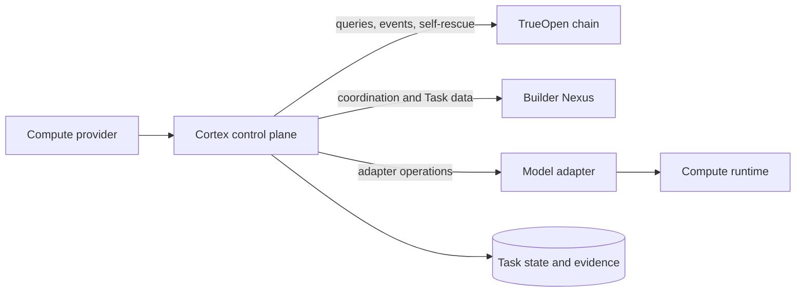

# Cortex architecture

Cortex is the local control plane of a compute provider. It turns chain assignments and Builder coordination messages into constrained calls to a model adapter, validates the returned material, and signs protocol actions.

## Components and trust

| Component | Trust role | Responsibility |
|---|---|---|
| Cortex control plane | Trusted | Keys, chain reconciliation, policy, Task state, signing, retries, and self-rescue |
| Model adapter | Constrained | Converts a model runtime into stable inference and verification operations |
| Compute runtime | Untrusted input to Cortex | Produces raw output, scores, and intermediate material |
| Task and evidence store | Recoverable local authority | Persists leases, signed material, deduplication records, evidence, and cursors |

The compute runtime does not decide protocol verdicts, hold the service key, or communicate directly with the chain or Builders. Cortex checks returned bindings and digests before signing.

## Outbound connections

A Cortex Node initiates connections to the chain, Builder Nexus endpoints, its adapter, and operator-controlled management systems. It does not require a public inbound endpoint.

An event or Nexus message prompts reconciliation; it is not final authority. Cortex uses chain queries to determine whether assignment, submission, settlement, or finality has been accepted.

## Trust order

Cortex evaluates information in this order:

1. Chain query results
2. Chain events, which trigger a query
3. Nexus acknowledgements and coordination messages
4. Runtime observations and operator configuration

A lower level cannot override a higher one. For example, a successful Nexus response proves transport, not chain acceptance.

## What Cortex does not do

Cortex does not participate in consensus, choose network-wide Workers or Verifiers, decide the final Task verdict, calculate final payouts, or convert local queue and hardware claims into protocol facts.

For practical operation, use the [compute provider guide](../README.md). To implement the runtime boundary, use the [model integrator guide](README.md).
