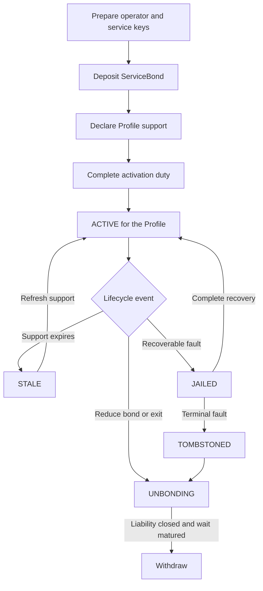

# Cortex Node lifecycle

This workflow follows one Cortex Node operator through its service lifecycle.

## Join

1. The operator prepares a stable operator account and a separate online service key.
2. The operator deposits the required ServiceBond and authorizes the service key.
3. The node declares supported Profile versions and its inference or verification capabilities.
4. The node completes a qualifying duty for each Profile it wants to activate.
5. The active node begins handraising for Tasks whose Profile, duty, and liability requirements it satisfies.

The operator address is the economic identity. Running more processes or machines behind the same operator does not create extra protocol identities, support votes, or bonds.

## Operate

An active node continually:

- Keeps its Profile support declarations fresh
- Observes candidate metadata and handraises only for work it can complete
- Persists signed Task material before sending it
- Tracks whether relayed actions were actually accepted on-chain
- Retains required result and evidence material through Task finality
- Preserves enough unreserved ServiceBond for new liabilities

If support freshness expires, the node becomes stale for future selection. Refreshing support can restore eligibility, but it does not extend or rewrite deadlines for Tasks already accepted.

## Rotate the service key

The operator first stops new handraises. It then waits until accepted Task liabilities, pending protocol submissions, and required duties reach zero.

The operator authorizes the replacement with a fresh nonce and proof that the new service key is controlled. The chain switches keys atomically. Historical receipts and duties remain attached to the operator; the old key immediately loses permission to submit new material.

## Fault and recovery

An objective fault may debit reserved responsibility funds and increase the operator's jail state. A recoverable jailed node may be allowed to perform bounded recovery duties with reduced candidate weight. Support renewal alone does not clear a jail.

Severe or repeated terminal responsibility can tombstone the operator. A tombstoned node cannot return to active service through an ordinary refresh or new service key.

## Reduce bond or exit

Reducing the bond or exiting starts unbonding and stops new eligibility. Existing Task duties, challenge exposure, evidence responsibility, and pending fault effects remain active.

Funds become withdrawable only after:

- The unbonding wait matures
- Every accepted Task liability closes
- Required evidence responsibility ends
- All applicable penalties have been applied

The released amount is the remaining balance after those responsibilities, not necessarily the amount originally requested.

See [Staking and penalties](../protocol/v1/service-participation/staking-and-penalties.md) for the governing rules.
